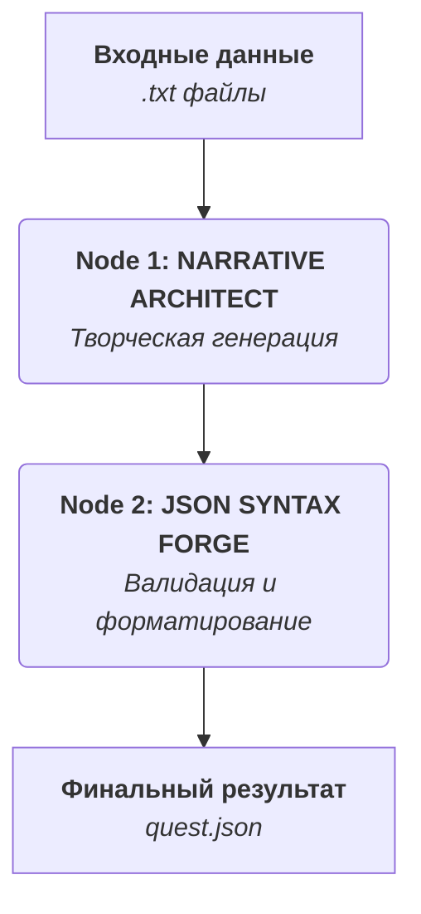

# Генератор Нелинейных Квестов (Hackathon Edition)

Прототип системы для генерации глубоких, нелинейных квестов на основе LLM, разработанный для трека «Генерация квестов и сюжетов». Система построена на базе визуального конструктора **Google Opal** и использует продвинутую архитектуру промптов для создания интерактивных историй с гарантированным ветвлением.

---

## 🚀 О проекте

Современные игры требуют сложных и увлекательных нарративов. Ручное создание разветвленных квестов — это трудоемкий процесс. Данный проект представляет собой инструмент, который автоматизирует создание основы для нелинейного квеста, принимая на вход краткое описание идеи и генерируя на выходе готовый к интеграции `JSON` файл.

В основе генератора лежит уникальная двухнодовая архитектура, обеспечивающая как креативную свободу, так и техническую надежность.

### Ключевые особенности

*   **Глубокая нарративная структура:** Генерация сюжета основана на проверенных сценарных моделях (архетипы Юнга, 6-этапная структура Майкла Хейга).
*   **Гарантированное ветвление:** Промпт включает **"Принцип Минимального Выбора"**, который запрещает создание сцен с одним вариантом действия, обеспечивая постоянную интерактивность.
*   **Персонаже-ориентированный подход:** История строится вокруг психотипа главного героя, его страхов и желаний.
*   **Гибкость:** Поддерживает разные жанры, стили диалогов и позволяет настраивать ключевые игровые параметры (статы).
*   **Надежный результат:** Двухэтапная архитектура (Генерация + Валидация) гарантирует синтаксически корректный `JSON` на выходе.

## ⚙️ Архитектура

Система состоит из двух последовательных нод в среде Google Opal, каждая из которых выполняет свою уникальную функцию.



#### Node 1: NARRATIVE ARCHITECT
Это "мозг" системы. Он принимает на вход текстовые файлы с описанием жанра, героя и цели и выполняет многоступенчатый протокол генерации:
1.  **Концептуализация:** Определяет архетип героя, генерирует его бэкграунд, лор мира и ключевые игровые параметры (`initial_stats`).
2.  **Проектирование сюжета:** Создает логлайн и синопсис "идеального" пути, а затем проектирует архитектуру ветвления с минимум двумя путями (Путь А - "Золотой путь" и Путь Б - "Альтернативный путь") с гарантированной глубиной не менее 3 сцен.
3.  **Наполнение сцен:** На основе архитектуры создает каждую сцену, наполняя ее текстом в заданном стиле и вариантами выбора, строго следуя **"Принципу Минимального Выбора"**.

#### Node 2: JSON SYNTAX FORGE
Это "технический контролер". Его единственная задача — взять потенциально несовершенный текстовый вывод от первой ноды и преобразовать его в идеально отформатированный, 100% валидный `JSON`. Это гарантирует, что конечный продукт всегда будет готов к использованию в игровом движке или приложении-визуализаторе.

---

## 🛠️ Как использовать

Для запуска генератора требуется среда, поддерживающая графы формата `.bgl.json` (например, Google Opal).

1.  **Подготовьте входные данные:**
    Создайте три текстовых файла. Примеры файлов можно найти в папке `/examples/inputs/`.

    *   `genre_hero_goal.txt`:
        ```
        Жанр: «Киберпанк»
        Главный герой: «Хакер-одиночка с долгами перед криминальным синдикатом»
        Цель: «Проникнуть в офис конкурентов, взломать их сервер и украсть компрометирующие данные, чтобы расплатиться с долгами»
        ```
    *   `scene_count.txt`:
        ```
        5
        ```
    *   `dialogue_style.txt`:
        ```
        Нуарный детектив (Hard-boiled)
        ``` 

2.  **Загрузите граф и ассеты:**
    *   Перейдите по https://opal.withgoogle.com/?flow=drive:/1gKYQlh__PezOClvSAw6SWm5pv-86XZ54&mode=app&shared=true (возможно понадобится VPN:USA) и используйте или нажмите кнопку remix или добавьте к себе вручную:
    *   Создайте папку 'Opal' в Google Drive и поместите файл 'Google Opal Quest Generator' в него.
    *   Откройте https://opal.withgoogle.com/ , затем авторизируйтесь через тот же аккаунт Google, и выберите нужный файл среди "Your Opal apps".
    *   Введите текст в качестве ассетов к соответствующим входам ноды `NARRATIVE ARCHITECT`.

3.  **Запустите генерацию:**
    *   Активируйте выполнение графа кнопкой 'Start'.
    *   Результат работы будет доступен на выходе из ноды `JSON SYNTAX FORGE` и будет представлен в виде готового файла `quest.json`.

---

## 📂 Структура проекта

```
/
├── README.md                 # Эта документация
├── opal_graph/
│   └── quest_generator.bgl.json  # Основной файл с логикой генератора
├── examples/
│   ├── inputs/                 # Примеры .txt файлов для входа
│   └── outputs/                # Примеры сгенерированных .json квестов
└── visualizer/
    └── quest-generator-app.tsx  # Код React-компонента для визуализации квестов
```

## 📄 Лицензия

Этот проект распространяется под лицензией MIT. Подробности см. в файле `LICENSE`.

## 🧑‍💻 Контакты

*   **Алим** - Product Manager - Telegram: @AlimLLC
